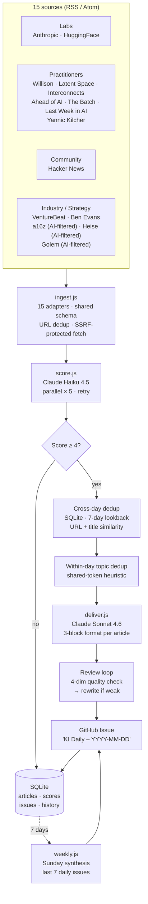

# KI-News Aggregator

A daily AI briefing for product managers and POs who are starting to build things themselves — with Claude Code, the Anthropic API, tools like that. Not aimed at developers.

---

## Who this is for

You're a senior PM or PO who's moved past just speccing things out for engineers. You're building stuff yourself, or seriously considering it. You want to know what's actually happening in AI — not for a roadmap presentation, but because you're trying to figure out what to experiment with next.

Most AI newsletters assume you either work at a lab or want to fine-tune a model. The ones aimed at business audiences are all market trends and funding rounds. Neither is useful when what you actually want to know is: what just became possible, and is there something worth trying with it this weekend?

Every morning at 05:30 UTC the pipeline fetches 15 sources, scores them for relevance, and writes up the articles that made the cut. Three blocks per article: what actually changed (no restating the headline), what it signals about where AI is heading, and a concrete project to try tonight with Claude Code — no server setup, no ML background required.

**See a real output:** [samples/example-daily.md](samples/example-daily.md) — a recent daily issue, exactly as it was generated and posted.

**Browse the full archive:** [kronprinzmagma.github.io/ki-news-aggregator](https://kronprinzmagma.github.io/ki-news-aggregator/) — every daily and weekly briefing as a static site, auto-rebuilt after each run.

**Build-anchor catalog:** [build-anchors/](build-anchors/) — one concrete evening project extracted per article, auto-committed daily. Grows into a browseable collection over time.

---

## What the write-ups look like

The briefing is in German (Swiss standard). Each article gets three blocks, capped at around 120 words total.

The first block covers what's new — factually, without hype, without repeating the headline. The second block ("Was es für die KI-Richtung heisst") is supposed to be an actual opinion: given this development, where is the field moving, and what should you be paying attention to? Not a summary of the article, more of a positioning take.

The third block is the build anchor. Every article has to produce one concrete project — something doable in an evening, alone, without infrastructure setup and without any ML background. The scope constraint (2–4 hours with Claude Code) is deliberate. Not "you could build a platform around this" but "here's the smallest thing you could make tonight that would actually teach you something."

Things that get filtered out before any of this: funding announcements, "AI is transforming industry X" pieces, and anything where the relevance only makes sense if you already have an engineering background.

---

## What the pipeline does

Three stages run sequentially:

**1. Ingest** — 15 adapters fetch RSS/Atom feeds and normalise each article into a shared schema (`titel`, `url`, `datum`, `quelle`, `rohtext`). Adapters for a16z and Heise Online apply keyword filters before passing articles downstream; a NewsAPI adapter exists but is currently inactive. URL deduplication runs at this stage; individual source failures do not abort the run.

**2. Score** — Each article is sent to `claude-haiku-4-5-20251001` with a relevance rubric calibrated to the product-builder persona. High-relevance signals: model capability jumps, hands-on SDK/MCP/eval patterns, agentic architecture insights, strategic market shifts. Low-relevance signals: generic "AI transforms industry" pieces, pure VC announcements, undifferentiated Show HN posts. Output is structured JSON (`score 1–5`, `begründung`) via tool-use. Only Score ≥ 4 reaches publication.

**3. Deliver** — Articles scoring ≥ 4 are processed by `claude-sonnet-4-6` into the fixed three-block format. A review loop checks every article on four dimensions — product relevance, technical substance, learning value, write-up quality — and rewrites any article flagged `needs_rewrite` before it enters the issue. The issue is published to GitHub; a Markdown summary and a JSON audit artefact are written to disk.

**Weekly** — A Sunday digest fetches the last 7 daily issues, deduplicates across days, and synthesises the week's Score-5 articles (plus 1–2 Score-4 picks) into a narrative: what happened, what it means, a critical framing.

---

## How it runs

```
05:30 UTC daily     →  ingest.js → score.js → deliver.js → GitHub Issue
08:00 UTC Sunday    →  weekly.js → GitHub Issue
```

A Watchdog workflow monitors the daily run and retriggers after failed publishes or other failed runs. A Close-Old-Issues workflow archives stale issues automatically.

---

## Pipeline architecture



---

## Why these 15 sources (and not 50)

Most aggregators in this space sell source count as a feature. This one deliberately stays small and asymmetric. Each source earns its slot by covering a specific angle for a single reader — a senior PM moving towards hands-on AI building.

| Layer | Sources | Why this slot exists |
|---|---|---|
| **Labs** | Anthropic, Hugging Face | First-party capability shifts. Anything filtered through a third party loses context. |
| **Practitioners** | Simon Willison, Latent Space, Interconnects (Nathan Lambert), Ahead of AI (Sebastian Raschka), The Batch, Last Week in AI, Yannic Kilcher | People who *build* with the models and explain trade-offs. Highest signal-to-noise on what actually works. |
| **Community** | Hacker News (front + Show HN, depriorised) | Captures release reactions and tooling discoveries the curated sources miss. Show HN is explicitly downscored to filter self-promotion. |
| **Industry + strategy** | VentureBeat, Ben Evans, a16z (AI-filtered), Heise (AI-filtered, DACH lens), Golem (AI-filtered, DACH lens with developer focus) | Market and adoption context, not capability — kept separate from labs/practitioners so it doesn't dominate. |

Sources that were considered and rejected:
- **Generic tech news** (TechCrunch, The Verge, Wired AI sections) — high volume, low signal density. Marketing rewrites of press releases.
- **Pure paper feeds** (arXiv direct, papers-with-code firehose) — too much noise without a practitioner-side filter. Curated practitioner sources catch the relevant papers anyway.
- **Twitter/X scraping** — operationally hostile, terms-of-service grey zone, signal is already redistributed by the curated practitioners.
- **VC newsletters** — funding announcements are explicitly down-scored in the relevance rubric.

The aggregator scores everything that comes in. A source that consistently drops below score 4 is a candidate for removal, not a reason to add three more sources to compensate.

---

## Engineering notes

**Structured LLM output via tool-use.** The scoring stage and the review pass use Anthropic's structured-output pattern: the model is forced to call a named tool (`submit_score`, `submit_review`) whose `input_schema` defines the exact return shape. No regex JSON-strip, no parse fallback — the API guarantees a schema-conformant object or fails the call. Downstream JSON files are still validated against Zod schemas in `lib/schema.js` as a second defence at the file-IO boundary.

**Prompt caching for cost efficiency.** The scoring stage sends the system prompt — including the full relevance rubric — as an Anthropic `cache_control: ephemeral` prefix. Only the per-article content varies across calls. This significantly reduces token cost on days with high article volume.

**Rate limiting and retry.** The scoring stage caps at 5 parallel Claude API requests. 429 responses trigger exponential backoff via a shared retry wrapper in `lib/claude.js`. Retry logic is centralised and not duplicated across callers.

**Cross-day deduplication via SQLite.** `better-sqlite3` backs a local `ki-news.db`. Articles published in a GitHub Issue are recorded in `issue_articles`; the deliver stage queries the last 7 days before selection. Title similarity (≥ 3 shared keywords, computed by `lib/topic-overlap.js`) catches repackaged articles that share no URL. Lookback window and threshold are configurable in `lib/config.js`.

**Topic-based deduplication within a day.** `lib/topic-overlap.js` implements a shared-token heuristic to detect thematically overlapping articles on the same day. When two articles cover the same topic, only the higher-scoring one proceeds; Lab sources (Anthropic, OpenAI, DeepMind, Latent Space, Simon Willison) win ties.

**Versioned metadata in GitHub Issues.** Each article block in a published issue contains an HTML comment marker `<!-- ki-news-meta: {...} -->` with structured metadata (url, score, source, date). The weekly digest and cross-day dedup read from these markers; a regex fallback handles issues predating the marker format.

**SSRF protection.** All outbound HTTP in `lib/http.js` resolves HTTPS targets before connecting, rejects private/reserved IPv4 and IPv6 addresses, pins the approved lookup into the request, and repeats the check on redirects. Adapters cannot be pointed at internal network addresses.

**Adapter base class.** `adapters/_base.js` provides HTTP fetch, RSS/Atom parsing, content extraction, and enrichment. Source-specific adapters extend this base; adding a new source requires only the feed URL and any source-specific filter logic.

**Shared config layer.** All model names, score thresholds, dedup parameters, and rate limits are defined once in `lib/config.js`. No magic numbers in application code.

**Cost tracking with cache visibility.** Every Claude API call is accumulated in `lib/claude.js` with full breakdown (input / output / `cache_read_input_tokens` / `cache_creation_input_tokens`), priced against current Anthropic rates and written to a `usage_log` table in SQLite per run. The per-run total — including cache hit rate — is logged to the console at the end of each stage and persisted in `run-summary-*.json` for the deliver stage. Makes both cost regressions and cache invalidation visible.

**Banned-phrases enforcement.** The deliver prompt explicitly forbids a short list of templates ("Build-vs-Buy verschiebt sich", "Effizienz wird zur Differenzierung", "der Engpass verschiebt sich") and marketing anglicisms ("Headroom", "Harness", "Mikroturn", "class-leading"). These are detected post-rewrite with a regex check in `lib/text-quality.js` and persisted into `run-summary-*.json`. Style consistency becomes auditable — any template that lands in the issue is logged.

**Self-critique visible in the output.** The review loop (a second Claude pass that scores each writeup on four dimensions and triggers a rewrite if weak) used to live only in the run-summary JSON. It now surfaces in each daily issue as a `<details>` footer: rewrite count, banned-phrase count, top process recommendations. Showing the self-critique is more honest than hiding it.

**Build anchors as a growing catalog.** The third block of each writeup is a concrete *build anchor* — an evening project doable in 2–4 hours with Claude Code. Each is extracted by `lib/build-anchors.js` into a separate `build-anchors/YYYY-MM-DD-slug.md` with frontmatter, auto-committed by the daily workflow. Over months this becomes a browseable catalog of evening-project ideas linked back to source articles. See [build-anchors/](build-anchors/).

**Adapter health monitoring.** Every ingest run records per-adapter stats (articles fetched, truncated count, error message) into an `adapter_health` table. The daily workflow restores and saves the SQLite run history between GitHub Actions runs, so three consecutive zero-article runs can file an idempotent `adapter-stale` issue. Catches silent feed breakage (URL moved, format changed, filter too strict) before it shows up as a thin daily issue.

**Static archive via GitHub Pages.** `scripts/build-archive.js` fetches all daily and weekly issues via the GitHub API (with pre-rendered HTML body) and generates a polished landing site. Auto-rebuilt after each daily/weekly run by `publish-archive.yml`. Live: [kronprinzmagma.github.io/ki-news-aggregator](https://kronprinzmagma.github.io/ki-news-aggregator/).

**Deterministic pre-filter + cross-day pre-dedup.** Before any article reaches the LLM, two cheap filters run: `lib/cross-day-dedup.js` drops articles that were already published in the last 7 daily issues (URL or title similarity), and a deterministic auto-score sets `score=2` for sources/formats that are structurally weak (`hackernews-show`, articles with `truncated=true`). On a typical run this drops ~60% of articles before the LLM ever sees them. Pure cost optimisation, zero quality risk — these articles would have been filtered out anyway downstream.

**Anthropic Batch API for scoring (50% cost reduction).** `lib/claude.js` exposes a `claudeBatch()` helper that submits all remaining score calls in one batch, polls until done, and parses the JSONL results. Async (typically <30 min), perfectly fine for a daily cron with no SLA. Cost tracking respects the 50% discount automatically. Together with the pre-filters: score-stage cost dropped from ~$0.23 to ~$0.05 per run (-78%).

**Feedback loop into the goldstandard.** Every article in the daily issue has four checkboxes (`besonders wertvoll`, `später weiterverfolgen`, `schlecht aufbereitet`, `irrelevanter Inhalt`). `scripts/promote-feedback.js` reads them across all issues, applies clear promotion logic (`wertvoll AND NOT schlecht_aufbereitet → human_score=5`; `irrelevant AND NOT schlecht_aufbereitet → human_score=1`), and grows `evals/goldstandard.json` passively from 3-second-clicks while reading. No dedicated evaluation sessions.

---

## Repository layout

```
ingest.js              — Stage 1: fetch and normalise articles
score.js               — Stage 2: relevance scoring via Claude Haiku
deliver.js             — Stage 3: write-up, review loop, GitHub Issue
weekly.js              — Sunday synthesis digest
adapters/              — One adapter per source (16 source files + _base.js;
                         15 davon aktiv verdrahtet, newsapi.js inaktiv)
lib/                   — Shared modules: claude, github, http, store,
                         schema, config, topic-overlap, issue-format, …
.github/workflows/     — daily-news.yml, weekly-digest.yml, watchdog,
                         close-old-issues, eval.yml, publish-archive.yml
```

---

## Stack

Node.js (ESM, no framework) · Claude API (Haiku 4.5 + Sonnet 4.6, structured outputs via tool-use) · `better-sqlite3` · Zod · GitHub Actions · GitHub Issues API

---

## Run your own instance

The whole pipeline is repo-agnostic. `REPO_OWNER`/`REPO_NAME` derive from the standard `GITHUB_REPOSITORY` env var that GitHub Actions sets automatically — fork and it just works, no code changes.

**Five steps to your own daily KI briefing:**

1. **Fork this repo** to your own account.
2. **Add two repository secrets** under *Settings → Secrets and variables → Actions*:
   - `ANTHROPIC_API_KEY` — your Anthropic API key
   - `GH_PAT` — a personal access token with `repo` scope (used to create/update issues; the default `GITHUB_TOKEN` doesn't have enough permissions for cross-workflow issue access)
3. **Enable GitHub Pages**: *Settings → Pages → Source: GitHub Actions*. The static archive site builds automatically after each daily run.
4. **Enable workflow runs**: *Actions* tab → enable workflows for the fork.
5. **Trigger the first run manually**: *Actions → Daily KI-News → Run workflow*. Subsequent runs happen automatically at 05:30 UTC daily.

**Customise the editorial direction:**
- `score.js` `SCORE_SYSTEM` — what you find relevant (default: senior PM/PO moving towards AI builder)
- `deliver.js` `ARTIKEL_PROMPT` — the writing style and three-block structure
- `ingest.js` `ADAPTERS` array — which 15 sources to fetch (or replace entirely)
- `lib/config.js` — score thresholds, dedup parameters, model choice

**Cost budget:** ~CHF 8/month at the default settings (Haiku for scoring with Batch API, Sonnet for writing). Toggle off Batch API with `SCORE_USE_BATCH=false` if you need synchronous behaviour.

---

## License

MIT.
